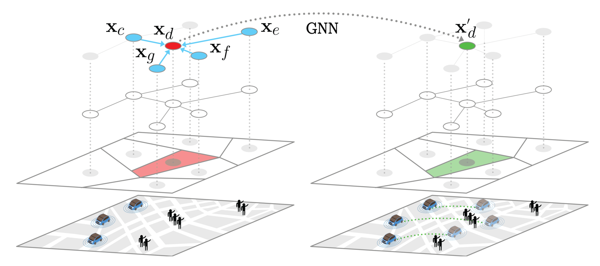

# Data-driven Methods for Network-level Coordination of Autonomous Mobility-on-Demand Systems Across Scales
Official implementation of the [Data-driven Methods for Network-level Coordination of Autonomous Mobility-on-Demand Systems Across Scales](https://rl4amod-itsc24.github.io/) tutorial, presented at 27th IEEE International Conference on Intelligent Transportation Systems 2024

</td> <br/>

## Prerequisites

* We recommend using CPLEX, however if you don't have access to a IBM cplex installation, we provide an alternative with the free python solver PulP. If you are a student or academic, IBM is releasing CPLEX Optimization Studio for free. You can find more info [here](https://community.ibm.com/community/user/datascience/blogs/xavier-nodet1/2020/07/09/cplex-free-for-students)


* You will need to have a working installation of SUMO (Simulation of Urban MObility). It is an open source microscopic and continous multi-modal traffic simulation package used to handle large networks. The repo is based on the version 1.20.0. Find the information for SUMO installation [here](https://sumo.dlr.de/docs/Installing/index.html)


* To install all required dependencies, run
```
pip install -r requirements.txt
```
## Contents
`amod_complete_repo`  
`├── figures/`: directory for saving the output figures<br>
`├── saved_files/`: directory for saving results, logging, etc<br>
`├── src/`  
`│   ├── algos/`  
`│   │   ├── sac.py`: Pytorch implementation of SAC<br>
`│   │   ├── a2c.py`: PyTorch implementation of A2C<br>
`│   │   ├── base.py`: Base class for baseline algorithms<br>
`│   │   ├── ed.py`: Implementation of an Equal Distribution policy<br>
`│   │   ├── no_reb.py`: Implementation of a no control policy<br>
`│   │   ├── plus_one.py`: implementation of a plus1 policy<br>
`│   │   ├── random.py`: implementation of a random policy<br>
`│   │   ├── MPC.py`: implementation of the MPC policy<br>
`│   │   ├── reb_flow_solver.py`: thin wrapper around CPLEX formulation of the Rebalancing problem<br>
`│   │   └── registry.py`: models registration function<br>
`│   ├── config/`: folder with the default parameters for the simulator and the models<br>
`│   ├── cplex_mod/`: CPLEX formulation of Rebalancing, Matching and MPC problems<br>
`│   ├── envs/`  
`│   │   ├── data/`: folder with the data for the macroscopic and mesoscopic scenarios (SUMO input files and json files for the demand)<br>
`│   │   └── sim/`  
`│   │   │    ├── macro_env.py`: implementation of a macroscopic simulator for AMoD systems system<br>
`│   │   │    └── sumo_env.py`: implementation of a SUMO-based mesoscopic simulator for AMoD systems<br>
`│   ├── misc/`: helper functions<br>
`│   ├── nets/`  
`│   │   ├── actor.py`: Pytorch implementation of a GNN-based actor<br>
`│   │   ├── critic.py`: Pytorch implementation of a GNN-based critic<br>
`├── testing.py`: test main file<br>
`├── train.py`: Rl agents train main file <br>

##  Configuration parameters
To run a training or a testing, firstly the simulator and the model type must be selected with the config arguments
```
config arguments:
    simulator           defines the simulator fidelity between 'macro' and 'sumo' (default: macro)
    model               defines the selected model: choose between the models saved in src/algos/registry.py file (default: sac)
```
### Simulators parameters
You need to pass the following argument to set a simulator parameter:
```
simulator.{arg}=value
```
Use the following argument for macroscopic simulator:
```
simulator=macro
```
```
macro simulator arguments:
    seed                random seed (default: 10)
    demand_ratio        ratio of demand (default: 0.5)
    json_hr             hour of the day for JSON configuratio (default: 7)
    json_tstep          minutes per timestep (default: 3 min)
    beta                cost of rebalancing (default: 0.5)
    city                city: defines the city to train or test on (default: 'nyc_brooklyn')
    max_steps           number of steps per episode (default: T=20)
    time_horizon        steps in the future for demand and arriving vehicle forecast (default: 6 min)
    directory           defines directory where to save files
```
Use the following argument for mesoscopic simulator:
```
simulator=sumo
```
```
sumo simulator arguments:
    sumocfg_file        define the SUMO configuration file
    net_file            define the city network file
    seed                random seed (default: 10)
    demand_ratio        demand ratio (default: 0.8)
    time_start          simulation start time in hours (default: 7)
    duration            episode duration in hours (default: 2 hr)
    time_horizon        matching steps in the future for demand and arriving vehicle forecast (default: 10 min)
    matching_tstep      minutes per timestep (default: 1 min)
    reb_tstep           minutes per timestep (default: 3 min)
    sumo_tstep          sumo time step (default: 1 s)
    max_waiting_time    maximum passengers waiting time for a ride (default: 10 min)
    beta                cost of rebalancing (default: 1)
    num_regions         number of regions for spatial aggregation (default: 8)
    random_od           demand aggregated in the centers of the regions (default: False)
    acc_init            initial number of taxis per region (default: 90)
    city                or test on (default: 'lux')
    directory           defines directory where to save files
```
### Models parameters
You need to pass the following argument to set a simulator parameter:
```
model.{arg}=value
```
Use the following argument for a2c agent:
```
model=a2c
```
```
a2c model arguments:
    agent_name          agent name for training or evaluation (default: today's date + '_a2c_gnn')
    cplexpath           defines directory of the CPLEX installation
    directory           defines directory where to save files
    max_episodes        number of episodes to train agent (default: 16k)
    max_steps           number of steps per episode (default: T=120)
    no_cuda             disables CUDA training (default: true)
    batch_size          defines batch size (default: 100)
    p_lr                define policy learning rate (default: 1e-3)
    q_lr                defines q-value learning rate (default: 1e-3)
    hidden_size         defines hidden units in the MLP layers (default: 256)
    clip                clip value for gradient clipping (default: 500)
    checkpoint_path     path where to save model checkpoints (A2C)
```

Use the following argument for sac agent:
```
model=sac
```
```
sac model arguments:
    agent_name          agent name for training or evaluation (default: today's date + '_sac_gnn')
    cplexpath           defines directory of the CPLEX installation
    max_episodes        number of episodes to train agent (default: 16k)
    no_cuda             disables CUDA training (default: true)
    batch_size          defines batch size (default: 100)
    p_lr                define policy learning rate (default: 1e-3)
    q_lr                defines q-value learning rate (default: 1e-3)
    alpha               defines entropy coefficient (default: 0.3)
    auto_entropy        use automatic entropy tuning (default: false)
    hidden_size         defines hidden units in the MLP layers (default: 256)
    clip                clip value for gradient clipping (default: 500)
    checkpoint_path     path where to save model checkpoints (SAC)
    rew_scale           defines reward scale (default: 0.01)
    use_LSTM            use LSTM in the model (default: false)
    input_size          number of node features (defalut: 13)
    test_episodes       number of episodes to test agent (default 10)
```

**Important**: Take care of specifying the correct path for your local CPLEX installation. Typical default paths based on different operating systems could be the following. If model.cplexpath = None, the PulP solver will be automatically called. 
```bash
Windows: "C:/Program Files/ibm/ILOG/CPLEX_Studio128/opl/bin/x64_win64/"
OSX: "/Applications/CPLEX_Studio128/opl/bin/x86-64_osx/"
Linux: "/opt/ibm/ILOG/CPLEX_Studio128/opl/bin/x86-64_linux/"
```

## Examples

### Training and simulating an agent

1. To train an agent (with the default parameters) run the following:
```
python train.py  simulator.name=="macro" model.name=="sac" simulator.city="nyc_brooklyn" model.checkpoint_path="SAC_custom"
```

2. To evaluate a pretrained agent run the following:
```
python testing.py  simulator.name=="macro" model.name=="sac" simulator.city="nyc_brooklyn" model.checkpoint_path="SAC_custom"
```

## Credits
This work was conducted as a joint effort with [Kaidi Yang*](https://sites.google.com/site/kdyang1990/), [James Harrison*](https://stanford.edu/~jh2/), [Filipe Rodrigues'](http://fprodrigues.com/), [Francisco C. Pereira'](http://camara.scripts.mit.edu/home/) and [Marco Pavone*](https://web.stanford.edu/~pavone/), at Technical University of Denmark' and Stanford University*. 

## Reference
```
@inproceedings{GammelliYangEtAl2021,
  author = {Gammelli, D. and Yang, K. and Harrison, J. and Rodrigues, F. and Pereira, F. C. and Pavone, M.},
  title = {Graph Neural Network Reinforcement Learning for Autonomous Mobility-on-Demand Systems},
  year = {2021},
  note = {Submitted},
}
```

----------
In case of any questions, bugs, suggestions or improvements, please feel free to contact me at csasc@dtu.dk.